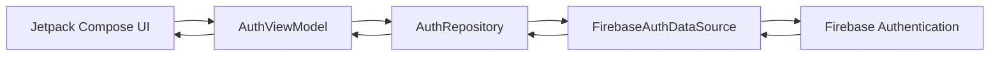

# 🔐 Authentication Lab

A modern Android authentication application built using **Kotlin**, **Jetpack Compose**, **Firebase Authentication**, and **MVVM Architecture**. This project demonstrates secure user authentication using Email/Password and Google Sign-In while following clean architecture principles and Android development best practices.

> 🚀 This project is part of my Android development portfolio, showcasing production-oriented architecture, modern UI development with Jetpack Compose, and Firebase Authentication integration.

---

# 📑 Table of Contents

- [📱 App Overview](#-app-overview)
- [✨ Features](#-features)
- [🛠 Tech Stack](#-tech-stack)
- [🏗 Architecture](#-architecture)
- [🔄 App Flow](#-app-flow)
- [📸 Screenshots / Demo](#-screenshots--demo)
- [🌐 Firebase Integration](#-firebase-integration)
- [📂 Project Structure](#-project-structure)
- [🎯 Use Cases](#-use-cases)
- [🚧 Future Improvements](#-future-improvements)
- [⚙️ Getting Started](#️-getting-started)
- [🙋 About Me](#-about-me)
- [📄 License](#-license)

---

# 📱 App Overview

Authentication Lab is a modern Android authentication application that demonstrates secure user authentication using **Firebase Authentication**. Users can create an account, log in using Email/Password, sign in with Google, reset forgotten passwords, and securely manage authentication state.

The project focuses on implementing authentication using **real-world Android architecture**, making it an excellent reference for developers learning Firebase Authentication and Jetpack Compose.

### Problem it solves

Authentication is one of the most fundamental features of modern mobile applications. This project demonstrates how to implement authentication in a clean, scalable, and maintainable way while following Android best practices.

---

# ✨ Features

- 🔐 Email & Password Registration
- 🔑 Email & Password Login
- 🔓 Google Sign-In using Android Credential Manager
- 📧 Password Reset via Email
- ✅ Email Verification Support
- 🎨 Fully Jetpack Compose UI
- 🧩 Reusable UI Components
- 📱 Responsive Material 3 Design
- 🧠 Input Validation
- ⚠️ User-Friendly Error Messages
- 🔄 Authentication State Management
- 🏗 MVVM Architecture
- 🔥 Firebase Authentication Integration

---

# 🛠 Tech Stack

| Category | Technology |
|----------|------------|
| Language | Kotlin |
| UI Toolkit | Jetpack Compose |
| Architecture | MVVM |
| State Management | StateFlow |
| Dependency Management | Gradle Kotlin DSL |
| Authentication | Firebase Authentication |
| Google Sign-In | Android Credential Manager |
| UI Design | Material 3 |
| Asynchronous Programming | Kotlin Coroutines |

---

# 🏗 Architecture

This project follows the **MVVM (Model-View-ViewModel)** architecture to maintain a clear separation of concerns.

- **UI Layer**
  - Displays UI
  - Handles user interactions

- **ViewModel**
  - Holds UI state
  - Processes user actions
  - Coordinates business logic

- **Repository**
  - Acts as a single source of truth
  - Abstracts data operations

- **Data Source**
  - Handles communication with Firebase Authentication

- **Firebase**
  - Authenticates users securely

## Data Flow



---

# 🔄 App Flow

```text
Launch App
      │
      ▼
Authentication Screen
      │
      ├───────────────┐
      │               │
      ▼               ▼
Login             Register
      │               │
      ▼               ▼
Firebase Authentication
      │
      ▼
Authentication Successful
      │
      ▼
Authenticated User
```

### User Journey

1. Open the application.
2. Choose one of the available authentication methods.
3. Register a new account or log in with an existing account.
4. Authenticate using Firebase Authentication.
5. Receive authentication status.
6. Access the authenticated section of the application.

---

# 📸 Screenshots / Demo

## Authentication Screen

> *(Add screenshot here)*

```
assets/screenshots/authentication.png
```

---

## Login Screen

> *(Add screenshot here)*

```
assets/screenshots/login.png
```

---

## Registration Screen

> *(Add screenshot here)*

```
assets/screenshots/register.png
```

---

## Forgot Password Screen

> *(Add screenshot here)*

```
assets/screenshots/forgot-password.png
```

---

## Demo Video

🎥 **YouTube Demo**

```
https://youtube.com/your-video-link
```

---

# 🌐 Firebase Integration

This project uses **Firebase Authentication** for secure user authentication.

## Authentication Methods

- Email & Password Authentication
- Google Sign-In using Credential Manager

## Authentication Flow

```text
User Input
     │
     ▼
ViewModel
     │
     ▼
Repository
     │
     ▼
Firebase Authentication
     │
     ▼
Authentication Result
```

## Error Handling

The application gracefully handles common authentication scenarios, including:

- Invalid email address
- Incorrect password
- User not found
- Weak password
- Email already registered
- Network connectivity issues
- Google Sign-In cancellation
- Unexpected Firebase exceptions

---

# 📂 Project Structure

```text
app
│
├── auth
│   ├── data
│   │   ├── datasource
│   │   ├── model
│   │   ├── repository
│   │   └── mapper
│   │
│   ├── presentation
│   │   ├── model
│   │   └── viewmodel
│   │
│   ├── ui
│   │   ├── component
│   │   └── screen
│   │
│   ├── validation
│   └── credential
│
├── navigation
├── theme
└── MainActivity.kt
```

---

# 🎯 Use Cases

This project is useful for:

- 📚 Learning Firebase Authentication
- 📱 Understanding modern Android architecture
- 🎓 Students learning Jetpack Compose
- 💼 Portfolio demonstration
- 🚀 Starting point for authentication-based Android applications
- 👨‍💻 Developers exploring Android Credential Manager

---

# 🚧 Future Improvements

Planned enhancements include:

- 🔐 Phone Number Authentication
- 🍎 Sign in with Apple (where applicable)
- 👤 User Profile Management
- 🖼 Profile Picture Upload
- ✏️ Update Email & Password
- 🔄 Session Persistence Improvements
- 🌙 Enhanced Theming
- 🌍 Localization Support
- 🧪 Unit & UI Testing
- 📊 Firebase Analytics Integration
- 🔔 Push Notifications
- ☁️ Firestore User Profile Storage

---

## 🤝 Open to Freelancing

I'm currently open to freelance opportunities involving:

- Android App Development
- Jetpack Compose
- Kotlin
- Firebase
- UI/UX Implementation
- Bug Fixing & Feature Development

If you'd like to collaborate, feel free to reach out!

---

# 📄 License

This project is licensed under the MIT License.
